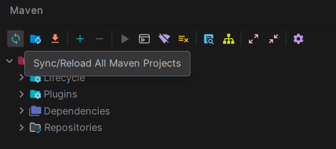
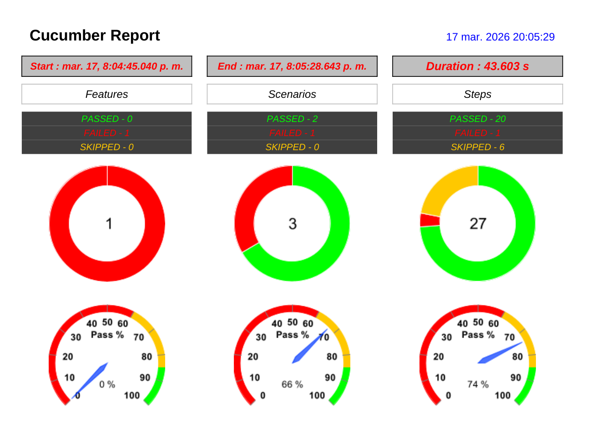
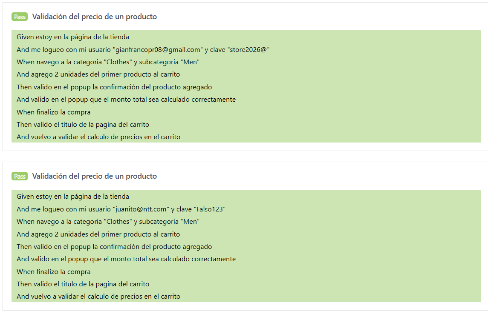
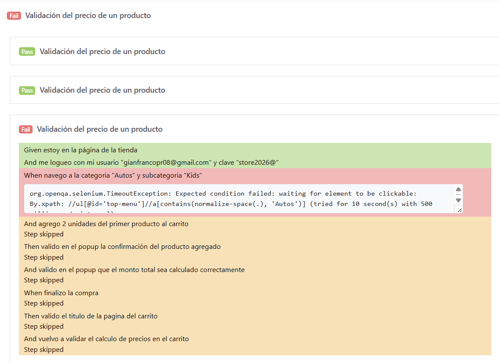

# QAInnovationLab
Automation Team / For education purpose

### Necesitas tener instalado Java 17 o superior y Maven para ejecutar el proyecto.
En IntelliJ debes realizar los siguientes pasos para ejecutar el proyecto:
1. En Maven, debes dar clic en el botón de "Reload All Maven Projects" para que se descarguen las dependencias necesarias.


2. Agregar el driver de Chrome
### Los reportes se encuentran en: 
1. PDF Report
```
    /target/reports/PdfReport.pdf
```


2. HTML Report
```
    /target/reports/SparkReport.html
```

